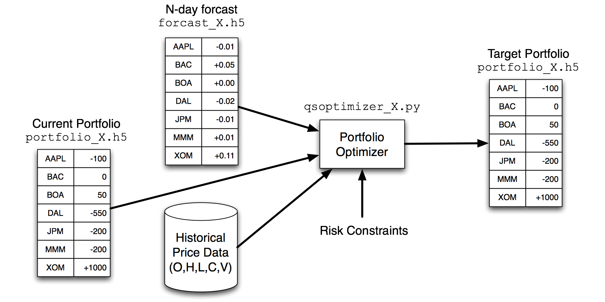

# Workflow Guide

We need workflow were used when creating the initial packages and need to be updated to reflect the current workflows.

{:class="img-responsive"}

{:class="img-responsive"}

{:class="img-responsive"}
