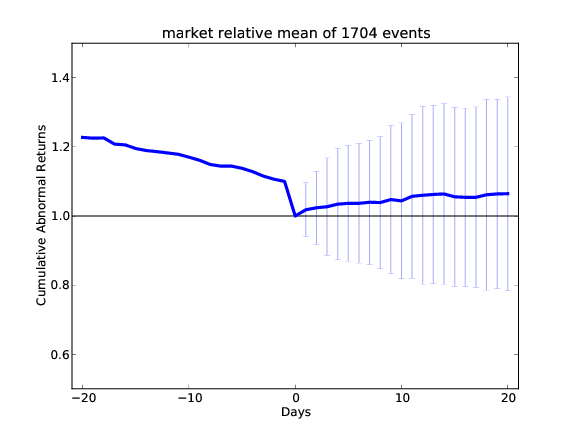
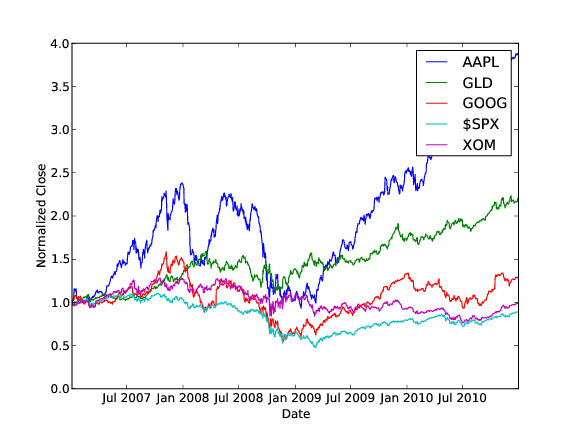
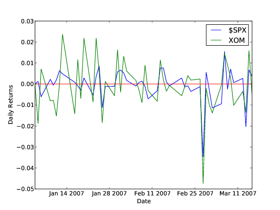
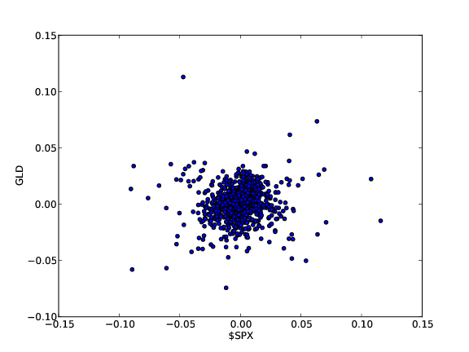

# Here are a few examples of what you can do fairly easily in pftk:

## Investigate how market events affect future returns


Pftk's event study software allows a developer to describe market events, then observe, statistically, how those events affect future equity prices. The plot at right illustrates the affect of the following market event:

* Equity list: S&P 500
* Event definition: (daily_return($SPX) < -0.03) and (daily_return(equity) < (daily_return($SPX) - 0.05))
* Event in English: The S&P 500 index drops more than 3% and the equity drops 5% more than the market
* Result: This scan triggered 1704 events in 2008, 2009, 2010.  On average, when this occurred, the stock gained 5% relative to the market over 20 days.

---

## Normalize and plot historical data

This is of course a basic task, but it is done quite easily with Python in pftk.  The data for the plot at right was created by reading in the closing prices of various equities, then normalizing their prices to 1.0 using one line of code:

``` python
normdat = pricedat/pricedat[0,:]
```


That line of code nicely illustrates how concise Python (with NumPy) can be.  If you have MATLAB experience, you
will see that the syntax for these operations is quite similar in Python.  With
that concise statement we executed 2000 divide operations.  Each row in pricedat
was divided by the first row of pricedat.  Thus normalizing the data with respect to
the first day's price.

---

## Compute and plot daily returns

It is very often useful to look at the returns by day for individual stocks.  We can compute this in Python as:

```
dailyrets = (pricedat[1:,:]/pricedat[0:-1,:]) - 1
```


In the figure at right we compare the daily returns for $SPX and XOM.  Observe that they tend to move together
but that XOM's moves are more extreme.  This plot was created with the following code in Python:
<br>
<br>
<br>
<br>
<br>
<br>

```
tsu.returnize0(normdat)
plt.plot(newtimestamps[0:50],normdat[0:50,3]) # $SPX 50 days
plt.plot(newtimestamps[0:50],normdat[0:50,4]) # XOM 50 days
plt.axhline(y=0,color='r')
plt.legend(['$SPX','XOM'])
plt.ylabel('Daily Returns')
plt.xlabel('Date')
savefig('rets.pdf',format='pdf')
```

---

## Look for correlations in daily returns


The scatter plots at right show how the movement in price of the S&P 500 index ($SPX) relate to XOM (top) and GLD (bottom).  Scatter plots are generated using the "scatter" command:

<br><br><br><br>

```
 plt.scatter(dailyrets[:,0],dailyrets[:,1],c='blue')
```


Note that XOM and $SPX seem strongly correlated, as evidenced by the tight scatter plot.  On the other hand $SPX and GLD are substantially less correlated.  It is easy to carry this sort of analysis further using many of the statistical tools available in NumPy and Pandas.

<br><br><br><br>

---

## Create and assess technical indicators


The plots show two technical indicators coded using pftk: A 20-day moving average (top), and 20-day Bollinger bands (bottom). The features are coded easily using Pandas and NumPy calls, such as the following code example for 20-day moving averages:

<br><br><br>

```
 means = pandas.rolling_mean(adjcloses,20,min_periods=20)
```


<br><br><br><br><br><br><br><br><br>

---

## Leverage machine learning tools to discover data relationships


Pftk includes several machine learning algorithms including HMM learning, KNN and K-D tree learning.
<br><br><br><br><br><br><br>

---