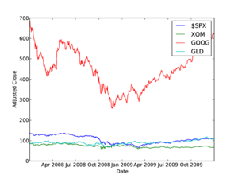

## pftk Tutorial 2

## Working with CSV Data

This tutorial is not really pftk specific, but it covers an important topic. Most of the time with pftk we read data in
using the _DataAccess_ class. This enables us to pull the information directly into a pandas DataMatrix object. However,
we also sometimes have to work with data in a CSV format. This is a short tutorial on that topic.

You can find this code in `pftk/Examples/Basic/tutorial2.py`.

**This example is for situations where the data includes numbers only** See [pftk\_Tutorial\_3](tutorial_3.md) for situations where the rows of data include equity symbols.

## The Data

Let's get started with a look at the data we'll be working with. (You'll find it in QSTK/Examples/Basic/example-data.csv; it is also on this wiki here: [example-data.csv](https://web.archive.org/web/20150323132914/http://wiki.quantsoftware.org/index.php?title=Example-data.csv "Example-data.csv").)

```
Year,Month,Day,SPY,XOM,GOOG,GLD
2008,1,2,137.67,87.81,685.19,84.86
2008,1,3,137.6,88.11,685.33,85.57
2008,1,4,134.23,86.47,657,85.13
2008,1,7,134.11,85.66,649.25,84.77
...
2009,12,28,112.19,67.68,622.87,108.55
2009,12,29,112.03,67.45,619.4,107.47
2009,12,30,111.99,67.38,622.73,106.93
2009,12,31,110.91,66.81,619.98,107.31
```

This is a typical CSV file with column names along the top. The date (timestamp) for each row of data is in the first three columns, and the adjusted closing price for four equities is listed in the remaining columns. The symbols of the corresponding equities are along the top row.

## Reading and Printing the Data

In this first section of the code (below) we read in (import) several useful libraries. numpy, pylab and matplotlib provide a number of functions to Python that give it MATLAB-like capabilities. datetime helps us manipulate dates.

```
import datetime as dt
import matplotlib.pyplot as plt
import pandas as pd
import numpy as np
```

Now we start with code to read in the data and divide it up.

```
na_data = np.loadtxt('example-data.csv', delimiter=',', skiprows=1)
na_price = na_data[:, 3:]
na_dates = np.int_(na_data[:, 0:3])
ls_symbols = ['SPY', 'XOM', 'GOOG', 'GLD']
```

In the first line above we use numpy's loadtxt() method to read data from a formatted file. We specify that the comma ',' is used to delimit data items, and also that we should skip the first row of data (the row that contains the stock names).

Next we slice the data into two parts, the date part and the price part. numpy provides sophisticated indexing and slicing capabilities similar to those that MATLAB allows. For more details on this take a look at [a numpy tutorial](https://web.archive.org/web/20150323132914/http://www.scipy.org/Tentative_NumPy_Tutorial), skip to the indexing and slicing section. Now here is some code to print the data we have, just to make sure we read it in properly. In the print statements we slice off the first 5 rows of each array:

```
print "First 5 rows of Price Data:"
    print na_price[:5, :]
    print "First 5 rows of Dates:"
    print na_dates[:5, :]
```

The code above prints out the following:

```
first 5 rows of price data:
[[ 137.67   87.81  685.19   84.86]
 [ 137.6    88.11  685.33   85.57]
 [ 134.23   86.47  657.     85.13]
 [ 134.11   85.66  649.25   84.77]
 [ 131.95   84.56  631.68   86.78]]

first 5 rows of dates:
[[2008    1    2]
 [2008    1    3]
 [2008    1    4]
 [2008    1    7]
 [2008    1    8]]
```

## Plotting the Data



The figure above shows the adjusted close data from the file. In this section we look at the code that generated it. First, we create date objects from the date data:

```
ldt_timestamps = []
for i in range(0, na_dates.shape[0]):
     ldt_timestamps.append(dt.date(na_dates[i, 0], na_dates[i, 1], na_dates[i, 2]))
```

Finally now, we're ready to display the data.

```
plt.clf()
plt.plot(ldt_timestamps, na_price)
plt.legend(ls_symbols)
plt.ylabel('Adjusted Close')
plt.xlabel('Date')
plt.savefig('adjustedclose.pdf', format='pdf')
```

The first line of code erases any previous plots on the graph. Not really necessary here, but I always put one in just for good measure. Next we iterate through the data for each stock and add it to the figure. pyplot automatically assigns a color to each line, but you can, if you like, assign your own colors. We add a legend with the symbol names and also add labels for the axes. Finally, with savefig the figure is written to a file.