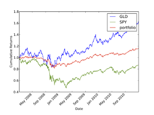

## pftk Tutorial 3

## Tips for accessing historical data

This tutorial focuses on some of the nitty-gritty details of reading in historical data. In many cases you'll want to
configure some information such as a list of symbols to work on in an input file, then read those in and operate on them
in some way. Sometimes though, there is a mis-match between the symbols you have and the symbols in the data store. This
tutorial covers shows how to address those issues in the context of a "quick n dirty" backtest. You can find the example
code in `pftk/Examples/tutorial3.py`.

**Note:** This example computes the performance of a portfolio that assumes **daily rebalancing** because it makes the back test a little easier. Daily rebalancing may not be possible or appropriate for all applications. (Homework 1 for the coursera course requires "buy and hold" and not daily rebalancing).

## The data describing a portfolio

The general idea is that we have a portfolio described in a CSV file (`pftk/Examples/Basic/tutorial3_portfolio.csv`). And we'd like to see how that portfolio would have performed if we had held it in the past. Here's the file describing the portfolio:

```
symbol, allocation
SPY,0.30
IJR,0.10
SPDW,0.15
SPEM,0.05
SPTL,0.15
LQD,0.10
GLD,0.10
RWR,0.05
```

The first column of the CSV file lists the symbol names, the second column is the allocation of the portfolio to each symbol. The allocations sum to 1.0 (100%): US large and small cap stocks, developed and emerging international stocks, long Treasuries, corporate bonds, gold and REITs. A portfolio file can contain symbols for which you have no data, so the code below checks for that. More on that below.

## Prologue

You'll need to import these modules:

```
import pftk.pftkutil.qsdateutil as du
import pftk.pftkutil.tsutil as tsu
import pftk.pftkkutil.DataAccess as da
import datetime as dt
import matplotlib.pyplot as plt
import pandas as pd
import numpy as np
```

## Reading in the portfolio description

NumPy provides a nice utility, loadtxt() for reading in CSV formatted data files. Here's the code for reading in the portfolio:

```
na_portfolio = np.loadtxt('tutorial3portfolio.csv', dtype='S5,f4',
                        delimiter=',', comments="#", skiprows=1)
print na_portfolio
```

The second line (dtype=) defines the format for each column. I think the other arguments are self explanatory. Now let's take a look at what we get back from this read:

```
[('SPY', 0.30000001192092896) ('GABBA', 0.20000000298023224),('GLD', 0.30000001192092896) ('7ABBA', 0.20000000298023224)]
```

Later on it will be helpful if our data is sorted by symbol name, so we'll do that next:

```
na_portfolio = sorted(na_portfolio, key=lambda x: x[0])
print na_portfolio
```

Which prints out:

```
[('7ABBA', 0.20000000298023224), ('GABBA', 0.20000000298023224), ('GLD', 0.30000001192092896), ('SPY', 0.30000001192092896)]
```

Now we build two lists, one that contains the symbols and one that contains the allocations:

```
ls_port_syms = []
lf_port_alloc = []
for port in na_portfolio:
    ls_port_syms.append(port[0])
    lf_port_alloc.append(port[1])
```

## Checking for spurious symbols and removing them

Now we're going to benefit from the horsepower of our DataAccess class and Python's set operations. First step is to see which symbols are available, then intersect that list with the symbols in our portfolio:

```
c_dataobj = da.DataAccess('EODHistoricalData')
ls_all_syms = c_dataobj.get_all_symbols()
ls_bad_syms = list(set(ls_port_syms) - set(ls_all_syms))
```

The second line above returns a list of all symbols available to us in the data store. On the third line above we convert the list of all symbols, and the list of symbols in our portfolio into sets, then remove the symbols not present in the ls\_all\_syms but present in the ls\_port\_syms. These are the bad symbols.

```
if len(ls_bad_syms) != 0:
        print "Portfolio contains bad symbols : ", ls_bad_syms
```

With the portfolio above every symbol has data, so nothing is printed. To see the check work, add a misspelled symbol to the CSV; the print out will look like `Portfolio contains bad symbols :  ['SPYY']`. Any bad symbol is removed from the portfolio with this code:

```
for s_sym in ls_bad_syms:
    i_index = ls_port_syms.index(s_sym)
    ls_port_syms.pop(i_index)
    lf_port_alloc.pop(i_index)
```

## Configuring times and reading the data

The list portsyms now contains the proper list of valid symbols, so we can ask DataAccess to return them for us with out blowing up. First we must set up the time boundaries as below:

```
dt_end = dt.datetime(2011, 1, 1)
dt_start = dt_end - dt.timedelta(days=1095)  # Three years
dt_timeofday = dt.timedelta(hours=16)

ldt_timestamps = du.getNYSEdays(dt_start, dt_end, dt_timeofday)

ls_keys = ['open', 'high', 'low', 'close', 'volume', 'actual_close']

ldf_data = c_dataobj.get_data(ldt_timestamps, ls_port_syms, ls_keys)
d_data = dict(zip(ls_keys, ldf_data))
```

The code above reads in the data for the symbols in our portfolio between the dates of Jan 1, 2011, back to 1095 days before that (3 years).

## Now, a quick and dirty back test

**Note:** this example computes portfolio returns assuming **daily rebalancing.** For coursera homework 1, you should not assume daily rebalancing.

The first step is to prep the data. We make a copy of our closing prices in to "rets", fill the data forward, then convert it into daily returns:

```
df_rets = d_data['close'].copy()
df_rets = df_rets.fillna(method='ffill')
df_rets = df_rets.fillna(method='bfill')

na_rets = df_rets.values
tsu.returnize0(na_rets)
```

Note that we extracted an ndarray from "close" (a pandas DataFrame), so we're now no longer benefitting from DataFrame features. You should consult other locations on this site for details on fill forward and converting into daily returns. For our combined portfolio we'll assume the combined return for each day is a sum of the returns for each equity weighted by the allocation. We can quickly compute the daily returns and the cumulative returns as follows:

```
na_portrets = np.sum(na_rets * lf_port_alloc, axis=1)
na_port_total = np.cumprod(na_portrets + 1)
```

In a similar manner we can compute the returns of the individual components as follows:

```
na_component_total = np.cumprod(na_rets + 1, axis=0)
```

That's it for the "back test." porttot contains the total returns for our combined portfolio.

## Plotting the results



```
plt.clf()
fig = plt.figure()
fig.add_subplot(111)
plt.plot(ldt_timestamps, na_component_total, alpha=0.4)
plt.plot(ldt_timestamps, na_port_total)
ls_names = ls_port_syms
ls_names.append('Portfolio')
plt.legend(ls_names)
plt.ylabel('Cumulative Returns')
plt.xlabel('Date')
fig.autofmt_xdate(rotation=45)
plt.savefig('tutorial3.pdf', format='pdf')
```

Note that the pyplot plot() command is smart enough to plot several lines at once if it is provided a 2D object (our component equities). pyplot automatically assigns a color to each line, but you can, if you like, assign your own colors. We add a legend with the symbol names and also add labels for the axes. Finally, with savefig the figure is written to a file.